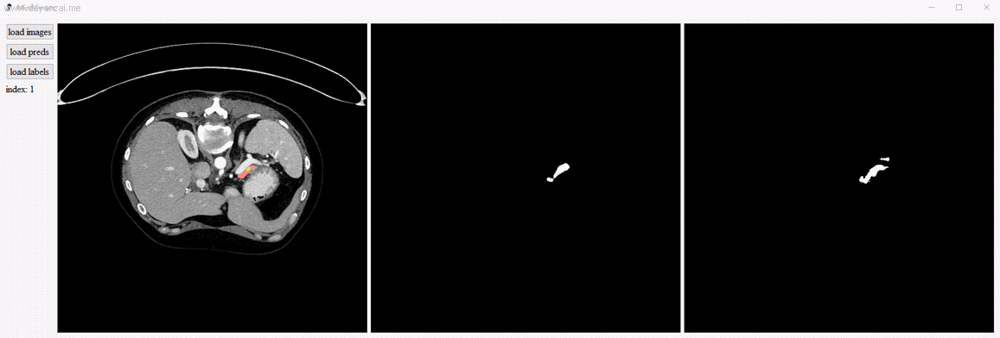

# MiniViewer
A MiniViewer for visualize medical images and respective labels which have been convert to numpy array [N\*H\*W].

## quick start

Run the demo by this command:

```
python main.py
```

It is very easy to use, as shown in followed Gif

* browse images by your mouse wheel


`contrast.py` is used to compare the predicted result with labels, where `preds.npy` is the predicted probability maps.

Run the new function by:
```
python contrast.py
```


* The red part represents the manual label, and the green part is the predicted result.

## New feature

Now, you can open Dicom files directly! (Controbuted by @airsimonhan)

## Contact
More features are coming!

For any question, feel free to contact
```
imaginist@sjtu.edu.cn
```
